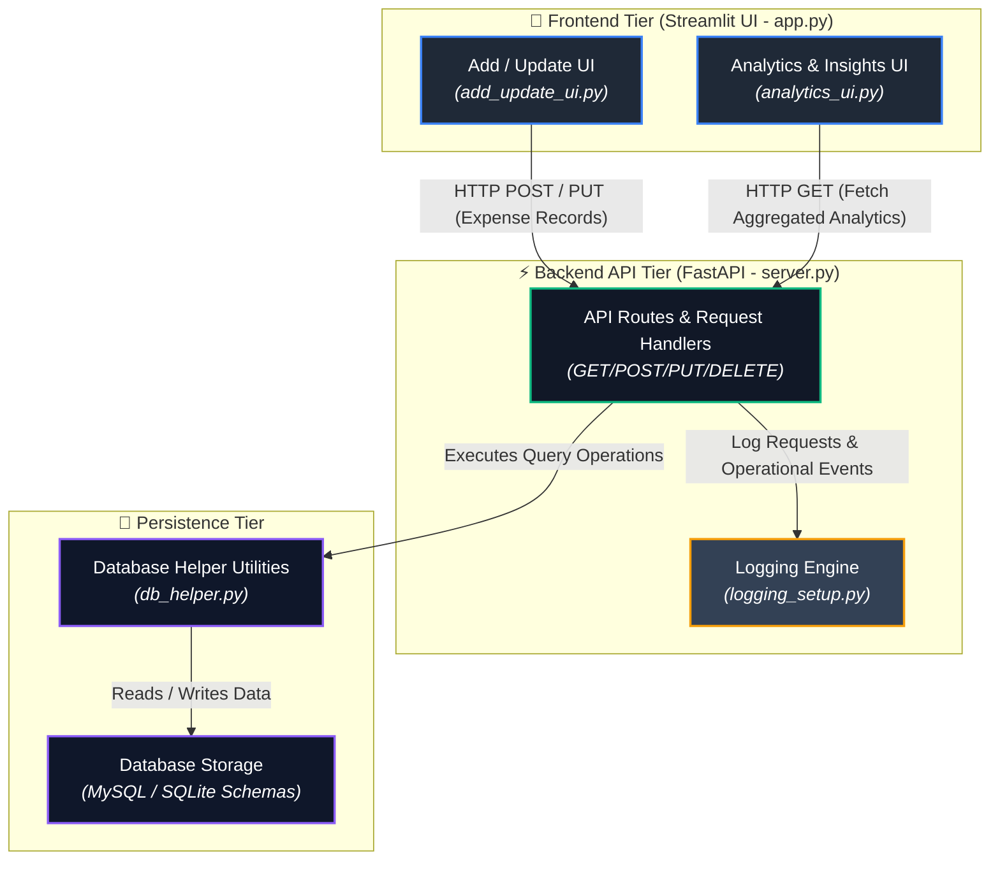

# 💰 Smart Expense Tracker System

A full-stack financial tracking application featuring a **FastAPI** backend for data management and an interactive **Streamlit** dashboard for seamless expense analytics.

---

## 📌 Project Overview

This repository provides a complete end-to-end solution for managing daily expenses, viewing visual analytics, and storing transactional logs safely.

* **Frontend**: Built with Streamlit for clean visual reporting and data input.
* **Backend**: Powered by FastAPI for high-performance API endpoints and data persistence.

---

    
## 📁 Repository Structure

```text
Smart-Expense-Tracker-System/
│
├── 📂 database/          # Database files and schemas
├── 📄 app.py             # Streamlit main entry point
├── 📄 add_update_ui.py   # UI module for adding & modifying records
├── 📄 analytics_ui.py    # UI module for visual insights & charts
├── 📄 db_helper.py       # Database utility & connection functions
├── 📄 server.py          # FastAPI server entry point
├── 📄 logging_setup.py   # Logging configuration
├── 📄 requirements.txt   # Python dependencies
└── 📄 README.md          # Project documentation

1. Clone the Repository
git clone [https://github.com/krishnegowda9/Smart-Expense-Tracker-System.git](https://github.com/krishnegowda9/Smart-Expense-Tracker-System.git)
cd Smart-Expense-Tracker-System

2. Install Dependencies
Ensure you have Python 3.8+ installed, then run:
pip install -r requirements.txt

3. Launch the FastAPI Backend
Start the backend server on http://localhost:8000:
uvicorn server:app --reload

4. Launch the Streamlit Frontend
In a new terminal window, run the UI:
streamlit run app.py

🛠️ Tech Stack
Language: Python

Backend: FastAPI, Uvicorn

Frontend: Streamlit

Database: MySQL / SQLite (configured via db_helper.py)
